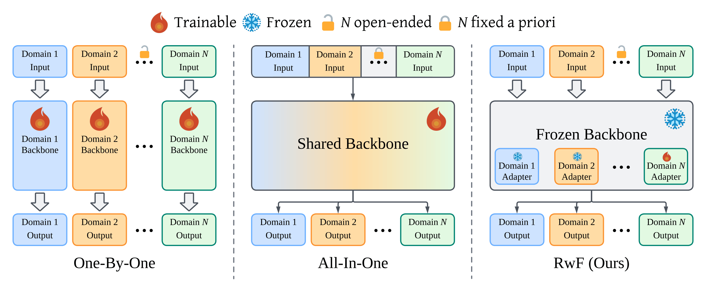
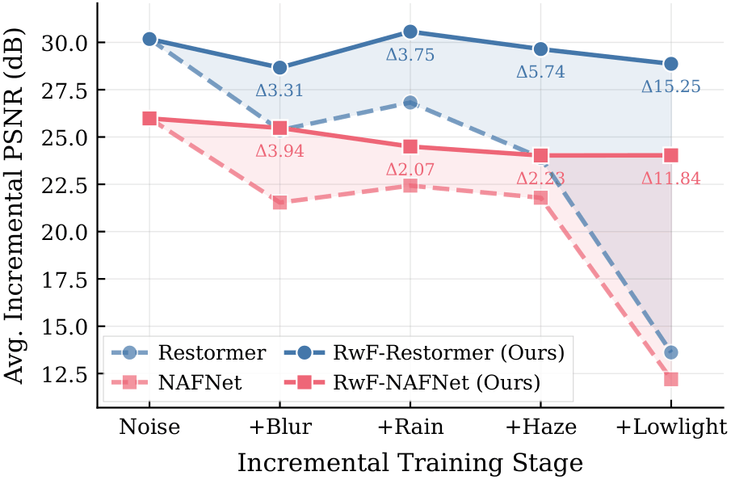
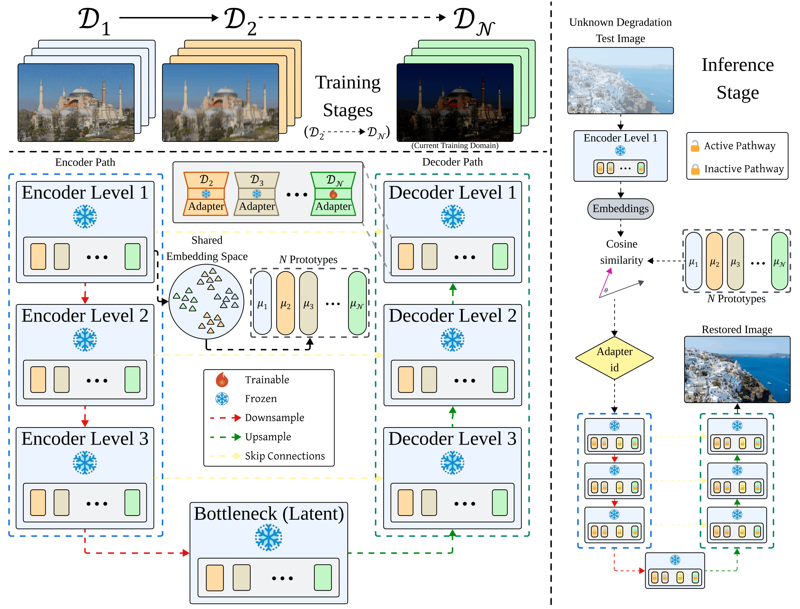

# Restoring Without Forgetting: Continual Learning Across Image Degradations

> BMVC 2026 &nbsp;|&nbsp; Alif Ashrafee, Bartosz Krawczyk &nbsp;|&nbsp; Rochester Institute of Technology

Official implementation of **RwF (Restoring without Forgetting)**, a parameter-efficient framework for continual multi-degradation image restoration.

<p align="center">
  
  
  <br>
  <em>Three paradigms for multi-degradation restoration (One-By-One / All-In-One / RwF), and average incremental PSNR across the five sequentially learned degradations. Sequential fine-tuning forgets as degradations accumulate; RwF holds performance across all domains.</em>
</p>

## Abstract

Recent progress in image restoration has converged on all-in-one architectures that jointly handle multiple degradations within a single network. These methods are effective on static benchmarks but target a closed-world setting that assumes simultaneous access to every target degradation at training time. In practice, degradations are encountered sequentially as field-deployed systems progressively face new environmental conditions, and historical training data is often unavailable due to privacy or storage constraints. Accommodating a new degradation then requires either retraining on the union of all prior data, which is often costly or infeasible, or fine-tuning, which causes catastrophic forgetting. We formulate multi-degradation image restoration as a continual domain-incremental learning problem, in which degradations arrive incrementally and prior data is unavailable. Our proposed Restoring without Forgetting (RwF) framework learns a lightweight adapter for each new degradation, eliminating forgetting by construction at a fraction of the cost of dedicated per-domain networks. To isolate degradation learning from dataset variation, we construct a benchmark spanning five degradation domains under shared image content. At test time, an unsupervised routing mechanism identifies the appropriate restoration path for unknown inputs without requiring domain labels. Across the five-domain sequence, RwF improves final average PSNR over naive sequential fine-tuning by 15.25 dB and 11.83 dB on the Restormer and NAFNet backbones, respectively. The framework transfers to eleven canonical real-degradation benchmarks (3,465 images) at 89.5% routing accuracy with only a +0.94 dB oracle PSNR gap, establishing, to our knowledge, the first systematic baseline for continual multi-degradation image restoration.

## Method

<p align="center">
  
  <br>
  <em>A denoising-pretrained encoder–decoder backbone is frozen, and each new degradation trains a network-spanning path of low-rank adapters under strict parameter isolation, leaving prior paths and the backbone unchanged. A domain prototype is formed by pooling encoder-stage 1 features. At inference, an unknown input is routed to the matching path, which restores the image.</em>
</p>

The domain sequence is fixed as **D1 (Noise) → D2 (Blur) → D3 (Rain) → D4 (Haze) → D5 (Low-light)**. D1 (Gaussian denoising) is instantiated directly by the frozen pretrained backbone; only adapter paths are trained for D2–D5.

> The `Motion_Deblurring/` directory name is inherited from the original Restormer task layout; here it is simply the working directory for this benchmark.

> Baselines (EWC, LwF): to keep this repository focused, the EWC and LwF continual-learning baselines are kept on a separate branch. Check out [`other-baselines`](../../tree/other-baselines) to reproduce them.

## Installation

Tested on Ubuntu with Python 3.10.12 and PyTorch 2.3.1 (CUDA 12.1). A single NVIDIA A100 is sufficient per training/evaluation stage.

```bash
git clone https://github.com/AlifAshrafee/Restoring-Without-Forgetting.git
cd Restoring-Without-Forgetting

conda create -n rwf python=3.10.12 -y
conda activate rwf

pip install -r requirements.txt
```

`requirements.txt` pins `torch==2.3.1` / `torchvision==0.18.1` built for CUDA 12.1. If your CUDA version differs, install the matching PyTorch build first (see [pytorch.org](https://pytorch.org)) and then run `pip install -r requirements.txt`.

> **Note:** haze synthesis (D4) uses MiDaS DPT-Hybrid for monocular depth, downloaded automatically via `torch.hub` on first use (requires internet; `timm` is already included in the requirements).

---

## 1. Download DIV2K

From the repository root:

```bash
bash download_div2k.sh
```

This populates:

```
datasets/DIV2K/
├── DIV2K_train_HR/   # 800 clean images (0001–0800)
└── DIV2K_valid_HR/   # 100 clean images (0801–0900)
```

## 2. Synthesize the degradation domains

Apply the five forward models to the shared DIV2K corpus (run from the repository root):

```bash
python generate_degradation_domains.py \
    --div2k_dir datasets/DIV2K \
    --output_dir datasets/multiple_degradations \
    --seed 42 --num_workers 8
```

Output (one paired dataset per domain, all sharing identical clean source content):

```
datasets/multiple_degradations/
├── D1_denoise/    { train, val } / { degraded, gt }
├── D2_deblur/     { train, val } / { degraded, gt }
├── D3_derain/     { train, val } / { degraded, gt }
├── D4_dehaze/     { train, val } / { degraded, gt }
├── D5_lowlight/   { train, val } / { degraded, gt }
└── metadata.json
```

Each operator is randomized per image within ranges chosen to match the corresponding restoration literature (`degradations.py`):

- **D1 Noise** — additive Gaussian, σ ∈ [15, 50] (AWGN).
- **D2 Blur** — motion kernel of length L ∈ [11, 41] px, direction θ ∈ [0°, 360°], curvature C ∈ [0.0, 0.6], plus occasional mild post-blur sensor noise (σ ∈ [1, 4]/255).
- **D3 Rain** — multi-layer streak composite with atmospheric veiling (Garg & Nayar / Yang et al. multi-layer model).
- **D4 Haze** — Koschmieder scattering with scattering coefficient β ∈ [0.05, 0.8] over MiDaS-estimated per-pixel depth, per-channel atmospheric light A ∈ [0.7, 1.0].
- **D5 Low-light** — gamma darkening γ ∈ [1.8, 4.5] followed by signal-dependent Poisson shot noise and Gaussian read noise (noise scale ∈ [0.01, 0.06]), following the SID sensor model.

The `--seed` flag makes the whole synthesis reproducible.

> Restrict synthesis to specific domains with `--domains D3_derain D4_dehaze`. D1_denoise is generated too — its images are only used later for D1 prototype extraction (D1 restoration itself is handled by the frozen backbone).

## 3. Generate training/validation patches

All patch generation and the `Datasets/` tree live inside `restormer/Motion_Deblurring/`. Run these from there:

```bash
cd restormer/Motion_Deblurring

# (a) training patches (512×512, overlap 256) + center-cropped validation patches (256×256)
python generate_patches_degradations.py \
    --src-root ../../datasets/multiple_degradations \
    --tar-root Datasets

# (b) full-size validation images (no cropping) — required by the per-domain test
python generate_patches_degradations.py \
    --src-root ../../datasets/multiple_degradations \
    --tar-root Datasets \
    --prepare_val_only --no-center-crop
```

This produces the following structure under `restormer/Motion_Deblurring/Datasets/`:

```
Datasets/
├── train/
│   ├── D1_denoise/    { input_crops, target_crops }   # feeds prototype extraction
│   ├── D2_deblur/     { input_crops, target_crops }
│   ├── D3_derain/     { input_crops, target_crops }
│   ├── D4_dehaze/     { input_crops, target_crops }
│   └── D5_lowlight/   { input_crops, target_crops }
└── val/
    ├── D2_deblur/                 { input_crops, target_crops }   # center-crop (domain-incremental eval)
    ├── D3_derain/                  { input_crops, target_crops }
    ├── D4_dehaze/                  { input_crops, target_crops }
    ├── D5_lowlight/                { input_crops, target_crops }
    ├── D2_deblur_Full_Images/      { input_crops, target_crops }   # full-size (per-domain eval)
    ├── D3_derain_Full_Images/      { input_crops, target_crops }
    ├── D4_dehaze_Full_Images/      { input_crops, target_crops }
    ├── D5_lowlight_Full_Images/    { input_crops, target_crops }
    └── CBSD68_sigma25_Full_Images/ { input_crops, target_crops }   # D1 eval — see note below
```

> **D1 evaluation set (`CBSD68_sigma25_Full_Images`):** following denoising convention, D1 is evaluated on CBSD68 (σ=25), not on DIV2K-synthesized noise. This set ships once inside the real-test-datasets zip, as `Datasets/test/D1_gaussian_denoising/CBSD68_sigma25/{degraded, gt}/`. The per-domain (§7a) and domain-incremental (§7b) evaluations instead expect it in the val tree under `input_crops`/`target_crops` naming, so copy it over once as shown in §7.

## 4. Place the pretrained denoising backbones

D1 is not trained — it is the released Gaussian-denoising checkpoint that seeds the frozen backbone. Place them here:

```
restormer/experiments/archived_checkpoints/Degradations_D1_only/
├── gaussian_color_denoising_blind.pth   # Restormer — official blind Gaussian color denoising weights
└── NAFNet-SIDD-width32.pth              # NAFNet — official SIDD width-32 weights
```

> Download links: **[Restormer denoising weights: [DRIVE LINK](https://drive.google.com/file/d/1yMDOlLYUVruC9ytXDKQdQICnhnTGq09A/view?usp=drive_link)]** · **[NAFNet SIDD width-32 weights: [DRIVE LINK](https://drive.google.com/file/d/1lsByk21Xw-6aW7epCwOQxvm6HYCQZPHZ/view)]**
>
> These are the official released checkpoints. The identical files are also included in the combined weights zip below, so if you download that you can skip this step.

## 5. Sequential training

Launch training from the `restormer/` directory (the config paths are relative to it). Each stage is 100k iterations on a single GPU.

```bash
cd restormer

# example: train the D2 adapter of RwF-Restormer
./train.sh Motion_Deblurring/Options/Degradations_D1_ft_D2_Restormer_Adapters.yml
```

Each run writes its checkpoint to `experiments/<ExperimentName>/models/net_g_latest.pth`.

### Config naming

Configs live in `Motion_Deblurring/Options/`. The naming encodes the stage and the model:

| | Sequential FT | RwF (adapters) |
|---|---|---|
| Restormer | `Degradations_..._ft_D{t}_Restormer.yml` | `Degradations_..._ft_D{t}_Restormer_Adapters.yml` |
| NAFNet | `Degradations_..._ft_D{t}_NAFNet.yml` | `Degradations_..._ft_D{t}_NAFNet_Adapters.yml` |

For RwF, each adapter config also sets `current_domain` (D2=0, D3=1, D4=2, D5=3) and `commit_loaded_adapter` (`false` for D2, `true` from D3 on) — these are already correct in the provided files; no edits needed.

### Chaining stages (the checkpoint archival step)

Stages are trained one at a time, and each stage loads the previous stage's checkpoint via its `pretrain_network_g:` field.

During training, BasicSR saves every intermediate checkpoint to `experiments/<ExperimentName>/models/` (e.g. `net_g_5000.pth`, `net_g_10000.pth`, …, `net_g_latest.pth`). To keep the working tree tidy, after each stage finishes we manually copy only the final `net_g_latest.pth` into a separate `experiments/archived_checkpoints/<dir>/` directory, and every subsequent config's `pretrain_network_g` points there. This is purely an organizational choice — it isolates the one checkpoint that matters from the many produced during training.

You have three equivalent ways to satisfy a stage's `pretrain_network_g`:

1. **Follow the archival convention (recommended).** After stage *t* finishes, copy `experiments/<ThisStage>/models/net_g_latest.pth` into the archived directory the next config names. Note the archived directory name is not identical to the experiment name (the backbone tag is dropped/relocated), so the safest rule is to grep the next config's `pretrain_network_g` field to see exactly where it expects the checkpoint.
2. **Repoint the YAML.** Simply edit the next config's `pretrain_network_g` to point at the previous stage's original save path (`experiments/<PrevStage>/models/net_g_latest.pth`) and skip the copy entirely.
3. **Download released weights.** Skip training altogether: download the released checkpoints (see [Pretrained weights, prototypes, and real test data](#pretrained-weights-prototypes-and-real-test-data)), create the archived directories, and place the weights there to run the evaluations directly.

The full RwF-Restormer chain, fully worked out:

| Stage | Train this config | Loads from | Copy output to |
|---|---|---|---|
| D2 | `Degradations_D1_ft_D2_Restormer_Adapters.yml` | `Degradations_D1_only/gaussian_color_denoising_blind.pth` | `archived_checkpoints/Degradations_D1_ft_D2_Adapters/net_g_latest.pth` |
| D3 | `Degradations_D1_D2_ft_D3_Restormer_Adapters.yml` | `Degradations_D1_ft_D2_Adapters/net_g_latest.pth` | `archived_checkpoints/Degradations_D1_D2_ft_D3_Adapters/net_g_latest.pth` |
| D4 | `Degradations_D1_D2_D3_ft_D4_Restormer_Adapters.yml` | `Degradations_D1_D2_ft_D3_Adapters/net_g_latest.pth` | `archived_checkpoints/Degradations_D1_D2_D3_ft_D4_Adapters/net_g_latest.pth` |
| D5 | `Degradations_D1_D2_D3_D4_ft_D5_Restormer_Adapters.yml` | `Degradations_D1_D2_D3_ft_D4_Adapters/net_g_latest.pth` | `archived_checkpoints/Degradations_D1_D2_D3_D4_ft_D5_Adapters/net_g_latest.pth` |

After D5, `Degradations_D1_D2_D3_D4_ft_D5_Adapters/net_g_latest.pth` is the complete RwF-Restormer model (frozen backbone + all four committed adapters). This single checkpoint is what every evaluation script below loads.

The RwF-NAFNet chain is identical in shape; its archived directories carry a `NAFNet` tag (e.g. `Degradations_NAFNet_D1_ft_D2_Adapters`, … → `Degradations_NAFNet_D1_D2_D3_D4_ft_D5_Adapters`). The Sequential FT chains follow the same procedure with the non-adapter configs. In every case, the target directory is whatever the next config's `pretrain_network_g` names.

---

## 6. Prototype extraction

Routing prototypes are extracted once, after all stages are trained, in a single sweep over the five domains' training crops:

```bash
cd restormer/Motion_Deblurring

PYTHONPATH=.. python extract_degradation_prototypes.py \
    --weights ../experiments/archived_checkpoints/Degradations_D1_D2_D3_D4_ft_D5_Adapters/net_g_latest.pth \
    --yaml_file Options/Degradations_D1_D2_D3_D4_ft_D5_Restormer_Adapters.yml \
    --data_root Datasets/train \
    --hook_layer encoder_level1[-1] \
    --max_samples 13800 \
    --batch_size 16 \
    --output ../experiments/archived_checkpoints/prototypes/proto_enc1_v2.pth
```

`--max_samples 13800` corresponds to ρ = 50% of the per-domain training crops (the paper's setting), and `--hook_layer encoder_level1[-1]` reads out at the last block of the first encoder stage (shallow features carry the strongest degradation cue).

**Why extract prototypes after training rather than during it?** All prototypes are computed through the frozen backbone with no adapter path engaged (`adapter_id = -1`). Because the backbone never changes across stages, the embedding produced for a given image is identical whether it is computed during that domain's training stage or afterward. Extracting prototypes post-training is therefore mathematically equivalent to collecting them per-stage, and it is far simpler — a single sweep over all five domains rather than saving each stage's prototype and merging it with the next. The result is a single `prototypes/*.pth` bank consumed by both routing-based evaluations below.

---

## 7. Evaluation

All evaluation runs from `restormer/Motion_Deblurring/`. Every script defaults to the final RwF-Restormer checkpoint and the `proto_enc1_v2.pth` prototype bank; override with `--weights`, `--yaml_file`, `--prototypes` as needed.

**One-time D1 setup.** The CBSD68 σ=25 set ships once in the real-test zip under `Datasets/test/D1_gaussian_denoising/CBSD68_sigma25/{degraded, gt}/`. The per-domain (§7a) and domain-incremental (§7b) evaluations expect it in the val tree under the `input_crops`/`target_crops` naming, so copy and rename it once (the real-degradation eval in §7c uses the original `test/` copy directly and needs no change):

```bash
mkdir -p Datasets/val/CBSD68_sigma25_Full_Images
cp -r Datasets/test/D1_gaussian_denoising/CBSD68_sigma25/degraded Datasets/val/CBSD68_sigma25_Full_Images/input_crops
cp -r Datasets/test/D1_gaussian_denoising/CBSD68_sigma25/gt       Datasets/val/CBSD68_sigma25_Full_Images/target_crops
```

### 7a. Per-domain (oracle) — Restormer and NAFNet

Tests one degradation at a time with the ground-truth adapter selected (the oracle setting). Reads `Datasets/val/<domain>_Full_Images/` (and `CBSD68_sigma25_Full_Images` for D1).

RwF-Restormer (final checkpoint; select the oracle adapter for each domain — D2=0, D3=1, D4=2, D5=3, D1=-1 for backbone-only):

```bash
# D2 (adapter 0)
PYTHONPATH=.. python test_degradations.py \
    --weights ../experiments/archived_checkpoints/Degradations_D1_D2_D3_D4_ft_D5_Adapters/net_g_latest.pth \
    --yaml_file Options/Degradations_D1_D2_D3_D4_ft_D5_Restormer_Adapters.yml \
    --domain D2_deblur --use_adapters --adapter_id 0

# D1 (backbone only)
PYTHONPATH=.. python test_degradations.py \
    --weights ../experiments/archived_checkpoints/Degradations_D1_D2_D3_D4_ft_D5_Adapters/net_g_latest.pth \
    --yaml_file Options/Degradations_D1_D2_D3_D4_ft_D5_Restormer_Adapters.yml \
    --domain D1_denoise --use_adapters --adapter_id -1
```

Sequential FT baseline (plain backbone, no adapters):

```bash
PYTHONPATH=.. python test_degradations.py \
    --weights ../experiments/archived_checkpoints/Degradations_D1_ft_D2/net_g_latest.pth \
    --yaml_file Options/Degradations_D1_ft_D2_Restormer.yml \
    --domain D2_deblur
```

NAFNet uses the same interface via `test_degradations_nafnet.py` and the `..._NAFNet[_Adapters].yml` configs.

### 7b. Domain-incremental (synthetic, with routing) — Restormer

The full DIL scenario: the prototype router picks the adapter from the input alone, evaluated across all five DIV2K-synthesized domains. Reports domain-identification accuracy and predicted-vs-oracle PSNR/SSIM. Reads center-crop val patches (`Datasets/val/<D>/`) plus `CBSD68_sigma25_Full_Images` for D1.

```bash
PYTHONPATH=.. python test_domain_incremental_degradations.py \
    --weights ../experiments/archived_checkpoints/Degradations_D1_D2_D3_D4_ft_D5_Adapters/net_g_latest.pth \
    --yaml_file Options/Degradations_D1_D2_D3_D4_ft_D5_Restormer_Adapters.yml \
    --prototypes ../experiments/archived_checkpoints/prototypes/proto_enc1_v2.pth \
    --data_root Datasets/val
```

### 7c. Real degradations (sim-to-real, with routing) — Restormer

Deploys the same model + router, without retraining, on eleven canonical real benchmarks. Reads `Datasets/test/<Dk_domain>/<test_set>/{degraded, gt}/`.

```bash
PYTHONPATH=.. python test_real_degradations_with_routing.py \
    --weights ../experiments/archived_checkpoints/Degradations_D1_D2_D3_D4_ft_D5_Adapters/net_g_latest.pth \
    --yaml_file Options/Degradations_D1_D2_D3_D4_ft_D5_Restormer_Adapters.yml \
    --prototypes ../experiments/archived_checkpoints/prototypes/proto_enc1_v2.pth \
    --input_dir Datasets/test/
```

Expected real-test directory layout (domain folder names must match exactly):

```
Datasets/test/
├── D1_gaussian_denoising/  { CBSD68_sigma25, Kodak24_sigma25, Urban100_sigma25 } / { degraded, gt }
├── D2_motion_deblurring/   { RealBlur_J, RealBlur_R } / { degraded, gt }
├── D3_image_deraining/     { Rain100H, Rain100L, Test100 } / { degraded, gt }
├── D4_image_dehazing/      { SOTS_Indoor, SOTS_Outdoor } / { degraded, gt }
└── D5_lowlight_enhancement/{ LOL_v1 } / { degraded, gt }
```

> Filter with `--domains` / `--test_sets`, save restorations with `--save_images` (add `--save_oracle` for the oracle path).

---

## Pretrained weights, prototypes, and real test data

**Model weights + prototypes:** **[DRIVE LINK](https://drive.google.com/file/d/1iahWY4R8QfuQ3KIqleOXEYI_XJmLBuMO/view?usp=drive_link)**. Download once and unzip so that `restormer/experiments/archived_checkpoints/` contains:

| Asset | Path (under `archived_checkpoints/`) |
|---|---|
| RwF-Restormer final checkpoint | `Degradations_D1_D2_D3_D4_ft_D5_Adapters/net_g_latest.pth` |
| RwF-NAFNet final checkpoint | `Degradations_NAFNet_D1_D2_D3_D4_ft_D5_Adapters/net_g_latest.pth` |
| Prototype bank | `prototypes/proto_enc1_v2.pth` |
| Denoising backbones (seed the frozen D1 backbone) | `Degradations_D1_only/{gaussian_color_denoising_blind.pth, NAFNet-SIDD-width32.pth}` |

**Real test datasets:** **[DRIVE LINK](https://drive.google.com/file/d/1CP2Zs8pkGH9ewWC5A9qSkd7ndlsW0IvE/view?usp=drive_link)**. Unzip into `restormer/Motion_Deblurring/Datasets/test/` (see §7c for the expected layout). For the D1 per-domain and domain-incremental evaluations, also copy the CBSD68 set into the val tree as shown in §7.

## Citation

```bibtex
@inproceedings{ashrafee2026rwf,
  title     = {Restoring Without Forgetting: Continual Learning Across Image Degradations},
  author    = {Ashrafee, Alif and Krawczyk, Bartosz},
  booktitle = {British Machine Vision Conference (BMVC)},
  year      = {2026}
}
```

## Acknowledgements

Built on [BasicSR](https://github.com/XPixelGroup/BasicSR), with backbones from [Restormer](https://github.com/swz30/Restormer) and [NAFNet](https://github.com/megvii-research/NAFNet). The benchmark is synthesized from [DIV2K](https://data.vision.ee.ethz.ch/cvl/DIV2K/).
